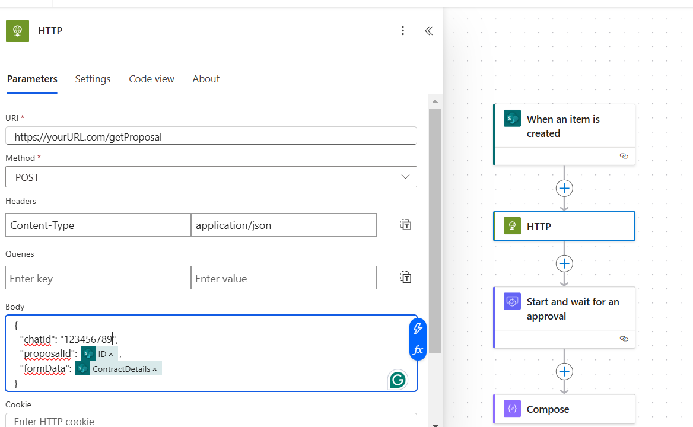
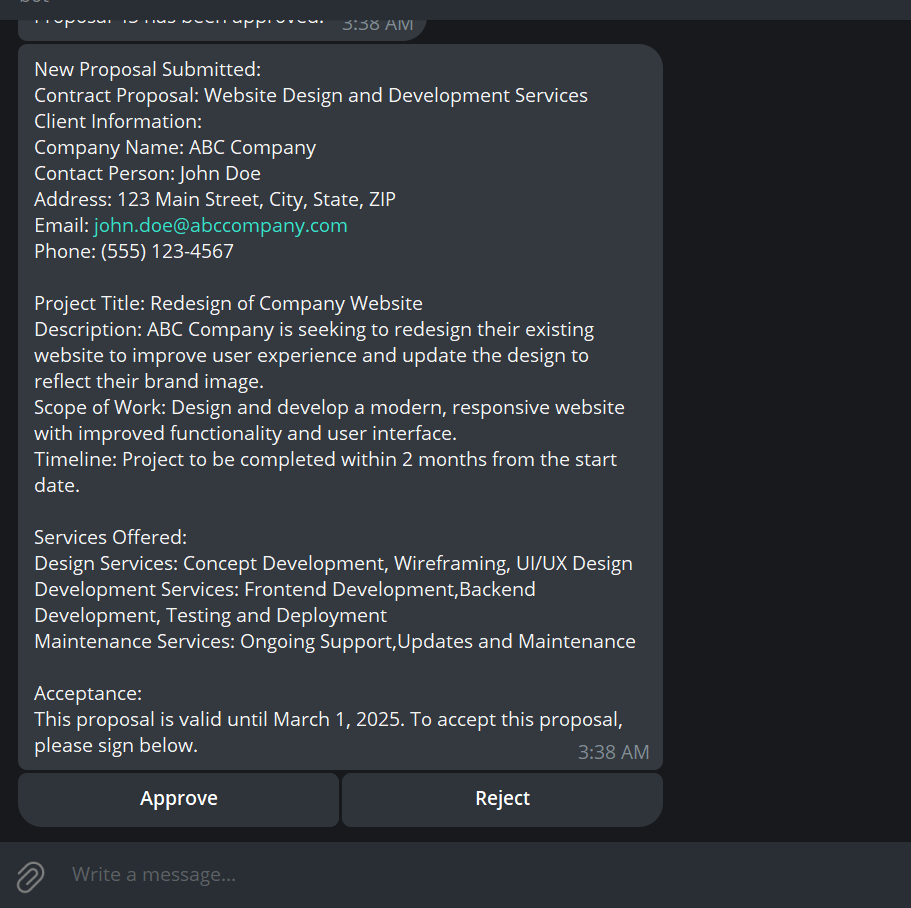

# Telegram Bot with Power Automate (Approvals) Integration

This project is a Telegram bot built with Node.js that integrates with Power Automate to handle form submissions and approval workflows. The bot allows users to approve or reject proposals sent to them via Telegram inline keyboards, and the decisions are communicated back to Power Automate for further processing.

## Features
- Receive form data from Power Automate via an HTTP POST request.
  
- Display form details to users in Telegram with inline keyboards for Approve/Reject actions.
  
- Send user responses (approval/rejection) back to Power Automate.
  


## Prerequisites
- Node.js installed on your machine.
- A Telegram Bot API token obtained from [BotFather](https://core.telegram.org/bots#botfather).
- A publicly accessible server (e.g., cPanel, VPS, or services like Ngrok).
- A Power Automate flow with an HTTP trigger.

## Installation

1. Clone the repository:
   ```bash
   git clone https://github.com/your-username/telegram-bot-power-automate.git
   cd telegram-bot-power-automate
   ```

2. Install dependencies:
   ```bash
   npm install
   ```

3. Configure environment variables:
   Create a `.env` file and add your Telegram Bot token:
   ```env
   TELEGRAM_BOT_TOKEN=your-telegram-bot-token
   ```

4. Start the server:
   ```bash
   node index.js
   ```

## Project Structure
- `index.js`: Main server and bot logic.
- `package.json`: Project dependencies and scripts.
- `.env`: Environment variables (not included in the repository for security).

## API Endpoints

### POST /getProposal
Accepts form data from Power Automate and sends a message to the specified Telegram user.

#### Request Body
```json
{
  "chatId": "123456789",
  "proposalId": "proposal123",
  "formData": "Details of the proposal."
}
```

#### Response
- **200 OK**: Message sent to Telegram successfully.
- **500 Internal Server Error**: Failed to send the message.

## Power Automate Integration

1. Create a flow with an HTTP trigger.
2. Copy the webhook URL provided by Power Automate.
3. Use the following payload in the bot's `axios.post` request:
   ```javascript
   axios.post('https://your-power-automate-webhook-url', {
       proposalId: proposalId,
       status: action === 'approve' ? 'Approved' : 'Rejected'
   }, {
       headers: {
           'Content-Type': 'application/json'
       }
   });
   ```
4. Ensure the Power Automate flow processes the `proposalId` and `status` fields correctly.

## Error Handling
- Logs errors to the console.
- Sends feedback to Telegram users if an action fails.

## Hosting on cPanel
1. Upload the project files to your cPanel server.
2. Configure Node.js in cPanel to run the project.
3. Use a publicly accessible URL for Power Automate integration.

## Troubleshooting
- If the bot is not responding, check:
  - The Telegram Bot Token.
  - Server logs for errors.
  - Network accessibility of the webhook URL.
- Test the Power Automate webhook URL with Postman before integration.


## Contact
For questions or support, feel free to contact me at fevenshibeshi@gmail.com.

